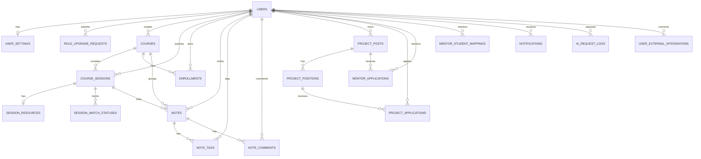

# KIACMS Step 2 - PostgreSQL ERD and JPA Entity Design

## 1. What This Step Implements

This step converts the Step 1 architecture into a concrete PostgreSQL schema design and a matching Spring Boot JPA entity layer.

Implemented in this step:

- PostgreSQL-oriented table design
- detailed field/type/constraint proposal
- relationship mapping between core entities
- enum candidates
- actual Spring Boot JPA entity code for the core domain model

Deferred to later steps:

- Flyway migration scripts
- repositories, services, controllers
- authentication token entities and flows
- notification dispatch logic
- AI service integration logic

## 2. Why This Design

### 2.1 UUID primary keys

- Use `UUID` for all business tables.
- Safer for external exposure than sequential numeric IDs.
- Works well for distributed operations and frontend references.

### 2.2 Explicit status enums

- Approval, enrollment, session progress, project application, and notification states are all explicit enums.
- This prevents ambiguous boolean combinations and improves API readability.

### 2.3 Unidirectional child-to-parent mappings by default

- Most relations are modeled from child to parent only.
- This keeps JPA graphs smaller, reduces accidental N+1 traversal, and avoids recursive serialization problems.

### 2.4 User soft delete strategy

- `users` uses `status = WITHDRAWN` plus `deleted_at`.
- We intentionally do not apply a global Hibernate filter on `User` at the entity level in Step 2.
- Reason: globally filtering withdrawn users can break historical foreign-key navigation for notes, projects, comments, and audit history.
- Instead, later repository/service queries for active users will default to `deleted_at IS NULL` and `status <> 'WITHDRAWN'`.

This is safer than hiding withdrawn users everywhere and accidentally losing referential traceability.

## 3. PostgreSQL Conventions

- ID type: `uuid`
- text-heavy fields: `text`
- short labels/codes: `varchar(n)`
- enums in JPA: `EnumType.STRING`
- timestamps: `timestamptz`
- dates: `date`
- times: `time`
- booleans: `boolean`

## 4. ERD Overview

## 5. Enum Candidates

### `RoleType`

- `STUDENT`
- `INSTRUCTOR`
- `MENTOR`
- `ROOT`

### `UserStatus`

- `PENDING`
- `APPROVED`
- `REJECTED`
- `WITHDRAWN`

### `ThemeMode`

- `LIGHT`
- `DARK`

### `RoleUpgradeRequestStatus`

- `PENDING`
- `APPROVED`
- `REJECTED`
- `CANCELLED`

### `CourseStatus`

- `PLANNED`
- `IN_PROGRESS`
- `COMPLETED`
- `ARCHIVED`

### `CourseSessionStatus`

- `SCHEDULED`
- `COMPLETED`
- `CANCELLED`

### `EnrollmentStatus`

- `ENROLLED`
- `COMPLETED`
- `DROPPED`

### `SessionWatchState`

- `NOT_STARTED`
- `IN_PROGRESS`
- `COMPLETED`

### `ProjectPostStatus`

- `OPEN`
- `CLOSED`
- `COMPLETED`
- `ARCHIVED`

### `ApplicationStatus`

- `SUBMITTED`
- `ACCEPTED`
- `REJECTED`
- `WITHDRAWN`

### `ContactMethodType`

- `EMAIL`
- `KAKAO_TALK`
- `DISCORD`
- `SLACK`
- `GITHUB`
- `NOTION`
- `GOOGLE_FORM`
- `OTHER`

### `MentorStudentMappingStatus`

- `ACTIVE`
- `ENDED`

### `NotificationType`

- `APPROVAL_RESULT`
- `ROLE_UPGRADE_RESULT`
- `SESSION_ZOOM_UPDATED`
- `SESSION_RECORDING_UPDATED`
- `SESSION_SUMMARY_UPDATED`
- `NOTE_TAGGED`
- `NOTE_COMMENTED`
- `PROJECT_APPLICATION_RECEIVED`
- `PROJECT_APPLICATION_RESULT`
- `MENTOR_APPLICATION_RECEIVED`
- `MENTOR_APPLICATION_RESULT`
- `SYSTEM_ANNOUNCEMENT`

### `NotificationTargetType`

- `COURSE`
- `COURSE_SESSION`
- `NOTE`
- `PROJECT_POST`
- `PROJECT_APPLICATION`
- `MENTOR_APPLICATION`
- `ROLE_UPGRADE_REQUEST`
- `USER_PROFILE`
- `DASHBOARD`
- `EXTERNAL_URL`

### `AiFeatureType`

- `NOTE_SUMMARY`
- `CAREER_COURSE_RECOMMENDATION`
- `SIMILAR_PROJECT_RECOMMENDATION`

### `AiRequestStatus`

- `SUCCESS`
- `FAILED`

### `AiReferenceType`

- `NOTE`
- `COURSE`
- `PROJECT_POST`
- `FREE_TEXT`

### `ExternalIntegrationProvider`

- `NOTION`

### `ExternalIntegrationStatus`

- `PENDING`
- `ACTIVE`
- `DISCONNECTED`
- `ERROR`

## 6. Table Design

### 6.1 `users`

Purpose:

- platform account
- role and approval state
- soft delete anchor

| Column | Type | Constraints | Notes |
|---|---|---|---|
| `id` | `uuid` | PK | UUID primary key |
| `email` | `varchar(150)` | NOT NULL, UNIQUE | login identifier |
| `password_hash` | `varchar(100)` | NOT NULL | BCrypt hash |
| `name` | `varchar(50)` | NOT NULL | display name |
| `phone_number` | `varchar(20)` | UNIQUE, NULLABLE | optional |
| `profile_image_url` | `varchar(500)` | NULLABLE | profile image |
| `bio` | `text` | NULLABLE | short intro |
| `role_type` | `varchar(30)` | NOT NULL | `RoleType` |
| `status` | `varchar(30)` | NOT NULL | `UserStatus` |
| `reviewed_by_id` | `uuid` | FK users(id), NULLABLE | root reviewer for signup |
| `reviewed_at` | `timestamptz` | NULLABLE | approval/rejection time |
| `account_status_reason` | `text` | NULLABLE | rejection or withdrawal reason |
| `last_login_at` | `timestamptz` | NULLABLE | security and analytics |
| `deleted_at` | `timestamptz` | NULLABLE | soft delete timestamp |
| `created_at` | `timestamptz` | NOT NULL | audit |
| `updated_at` | `timestamptz` | NOT NULL | audit |

Recommended indexes:

- unique index on `email`
- unique index on `phone_number`
- index on `(status, role_type)`
- index on `reviewed_by_id`

### 6.2 `user_settings`

| Column | Type | Constraints | Notes |
|---|---|---|---|
| `id` | `uuid` | PK | UUID primary key |
| `user_id` | `uuid` | NOT NULL, UNIQUE, FK users(id) | one-to-one |
| `theme_mode` | `varchar(20)` | NOT NULL | `ThemeMode` |
| `notifications_enabled` | `boolean` | NOT NULL | in-app notification preference |
| `timezone` | `varchar(50)` | NOT NULL | default `Asia/Seoul` |
| `locale` | `varchar(20)` | NOT NULL | default `ko-KR` |
| `created_at` | `timestamptz` | NOT NULL | audit |
| `updated_at` | `timestamptz` | NOT NULL | audit |

### 6.3 `role_upgrade_requests`

| Column | Type | Constraints | Notes |
|---|---|---|---|
| `id` | `uuid` | PK | UUID primary key |
| `requester_id` | `uuid` | NOT NULL, FK users(id) | requester |
| `current_role` | `varchar(30)` | NOT NULL | current role snapshot |
| `requested_role` | `varchar(30)` | NOT NULL | requested role |
| `request_reason` | `text` | NOT NULL | request content |
| `status` | `varchar(30)` | NOT NULL | request status |
| `reviewed_by_id` | `uuid` | FK users(id), NULLABLE | root reviewer |
| `reviewed_at` | `timestamptz` | NULLABLE | decision time |
| `rejection_reason` | `text` | NULLABLE | required when rejected |
| `created_at` | `timestamptz` | NOT NULL | audit |
| `updated_at` | `timestamptz` | NOT NULL | audit |

Recommended indexes:

- index on `(requester_id, status)`
- index on `(requested_role, status)`

Operational note:

- Add a partial unique index later to allow only one pending request per requester:
  `unique(requester_id) where status = 'PENDING'`

### 6.4 `courses`

| Column | Type | Constraints | Notes |
|---|---|---|---|
| `id` | `uuid` | PK | UUID primary key |
| `course_code` | `varchar(50)` | NOT NULL, UNIQUE | human-friendly code |
| `title` | `varchar(150)` | NOT NULL | course title |
| `description` | `text` | NULLABLE | course description |
| `track_name` | `varchar(100)` | NULLABLE | academy track |
| `status` | `varchar(30)` | NOT NULL | `CourseStatus` |
| `start_date` | `date` | NOT NULL | course start |
| `end_date` | `date` | NOT NULL | course end |
| `max_capacity` | `integer` | NULLABLE | optional |
| `created_by_id` | `uuid` | NOT NULL, FK users(id) | root creator |
| `created_at` | `timestamptz` | NOT NULL | audit |
| `updated_at` | `timestamptz` | NOT NULL | audit |

### 6.5 `course_sessions`

| Column | Type | Constraints | Notes |
|---|---|---|---|
| `id` | `uuid` | PK | UUID primary key |
| `course_id` | `uuid` | NOT NULL, FK courses(id) | owning course |
| `session_order` | `integer` | NOT NULL | 1, 2, 3... |
| `title` | `varchar(150)` | NOT NULL | session title |
| `description` | `text` | NULLABLE | session summary |
| `session_date` | `date` | NOT NULL | scheduled date |
| `start_time` | `time` | NOT NULL | start time |
| `end_time` | `time` | NOT NULL | end time |
| `status` | `varchar(30)` | NOT NULL | `CourseSessionStatus` |
| `instructor_id` | `uuid` | NOT NULL, FK users(id) | assigned instructor |
| `created_at` | `timestamptz` | NOT NULL | audit |
| `updated_at` | `timestamptz` | NOT NULL | audit |

Unique constraints:

- `(course_id, session_order)`

Recommended indexes:

- `(instructor_id, session_date)`
- `(course_id, session_date)`

### 6.6 `session_resources`

| Column | Type | Constraints | Notes |
|---|---|---|---|
| `id` | `uuid` | PK | UUID primary key |
| `course_session_id` | `uuid` | NOT NULL, UNIQUE, FK course_sessions(id) | one-to-one |
| `zoom_link` | `varchar(500)` | NULLABLE | set by instructor |
| `recording_link` | `varchar(500)` | NULLABLE | set after class |
| `summary_link` | `varchar(500)` | NULLABLE | external summary link |
| `additional_notice` | `text` | NULLABLE | instructor note |
| `zoom_link_updated_at` | `timestamptz` | NULLABLE | audit |
| `recording_link_updated_at` | `timestamptz` | NULLABLE | audit |
| `summary_link_updated_at` | `timestamptz` | NULLABLE | audit |
| `last_updated_by_id` | `uuid` | FK users(id), NULLABLE | instructor or root |
| `created_at` | `timestamptz` | NOT NULL | audit |
| `updated_at` | `timestamptz` | NOT NULL | audit |

### 6.7 `enrollments`

| Column | Type | Constraints | Notes |
|---|---|---|---|
| `id` | `uuid` | PK | UUID primary key |
| `student_id` | `uuid` | NOT NULL, FK users(id) | enrolled student |
| `course_id` | `uuid` | NOT NULL, FK courses(id) | target course |
| `status` | `varchar(30)` | NOT NULL | `EnrollmentStatus` |
| `enrolled_by_id` | `uuid` | FK users(id), NULLABLE | root manager |
| `completed_at` | `timestamptz` | NULLABLE | completion time |
| `created_at` | `timestamptz` | NOT NULL | enrollment timestamp |
| `updated_at` | `timestamptz` | NOT NULL | audit |

Unique constraints:

- `(student_id, course_id)`

### 6.8 `session_watch_statuses`

| Column | Type | Constraints | Notes |
|---|---|---|---|
| `id` | `uuid` | PK | UUID primary key |
| `student_id` | `uuid` | NOT NULL, FK users(id) | student |
| `course_session_id` | `uuid` | NOT NULL, FK course_sessions(id) | watched session |
| `status` | `varchar(30)` | NOT NULL | `SessionWatchState` |
| `last_watched_at` | `timestamptz` | NULLABLE | last progress update |
| `completed_at` | `timestamptz` | NULLABLE | set when completed |
| `created_at` | `timestamptz` | NOT NULL | audit |
| `updated_at` | `timestamptz` | NOT NULL | audit |

Unique constraints:

- `(student_id, course_session_id)`

### 6.9 `notes`

| Column | Type | Constraints | Notes |
|---|---|---|---|
| `id` | `uuid` | PK | UUID primary key |
| `author_id` | `uuid` | NOT NULL, FK users(id) | student author |
| `course_id` | `uuid` | NOT NULL, FK courses(id) | owning course |
| `course_session_id` | `uuid` | FK course_sessions(id), NULLABLE | optional session link |
| `title` | `varchar(200)` | NOT NULL | note title |
| `content` | `text` | NOT NULL | note body |
| `last_tagged_at` | `timestamptz` | NULLABLE | latest tag event |
| `created_at` | `timestamptz` | NOT NULL | audit |
| `updated_at` | `timestamptz` | NOT NULL | audit |

Recommended indexes:

- `(author_id, created_at)`
- `(course_id, created_at)`
- `(course_session_id, created_at)`

### 6.10 `note_tags`

| Column | Type | Constraints | Notes |
|---|---|---|---|
| `id` | `uuid` | PK | UUID primary key |
| `note_id` | `uuid` | NOT NULL, FK notes(id) | target note |
| `tagged_instructor_id` | `uuid` | NOT NULL, FK users(id) | instructor recipient |
| `tagged_by_id` | `uuid` | NOT NULL, FK users(id) | tag initiator |
| `notification_sent` | `boolean` | NOT NULL | dispatch marker |
| `created_at` | `timestamptz` | NOT NULL | audit |
| `updated_at` | `timestamptz` | NOT NULL | audit |

Unique constraints:

- `(note_id, tagged_instructor_id)`

### 6.11 `note_comments`

| Column | Type | Constraints | Notes |
|---|---|---|---|
| `id` | `uuid` | PK | UUID primary key |
| `note_id` | `uuid` | NOT NULL, FK notes(id) | parent note |
| `author_id` | `uuid` | NOT NULL, FK users(id) | instructor author |
| `content` | `text` | NOT NULL | comment body |
| `edited_at` | `timestamptz` | NULLABLE | latest edit time |
| `created_at` | `timestamptz` | NOT NULL | audit |
| `updated_at` | `timestamptz` | NOT NULL | audit |

### 6.12 `project_posts`

| Column | Type | Constraints | Notes |
|---|---|---|---|
| `id` | `uuid` | PK | UUID primary key |
| `owner_id` | `uuid` | NOT NULL, FK users(id) | PM / author |
| `title` | `varchar(200)` | NOT NULL | project title |
| `description` | `text` | NOT NULL | overall project description |
| `goal` | `text` | NOT NULL | target outcome |
| `tech_stack` | `text` | NOT NULL | MVP stores plain text |
| `duration_text` | `varchar(100)` | NOT NULL | project duration summary |
| `contact_method` | `varchar(30)` | NOT NULL | `ContactMethodType` |
| `contact_value` | `varchar(255)` | NOT NULL | email, link, handle |
| `pm_introduction` | `text` | NOT NULL | PM intro |
| `pm_background` | `text` | NOT NULL | PM spec / background |
| `status` | `varchar(30)` | NOT NULL | `ProjectPostStatus` |
| `recruit_until` | `date` | NULLABLE | optional deadline |
| `closed_at` | `timestamptz` | NULLABLE | when closed |
| `created_at` | `timestamptz` | NOT NULL | audit |
| `updated_at` | `timestamptz` | NOT NULL | audit |

Recommended indexes:

- `(owner_id, status)`
- `(status, recruit_until)`

### 6.13 `project_positions`

| Column | Type | Constraints | Notes |
|---|---|---|---|
| `id` | `uuid` | PK | UUID primary key |
| `project_post_id` | `uuid` | NOT NULL, FK project_posts(id) | parent post |
| `name` | `varchar(100)` | NOT NULL | example: Backend |
| `description` | `text` | NULLABLE | role summary |
| `required_skills` | `text` | NULLABLE | free text |
| `capacity` | `integer` | NOT NULL | number of recruits |
| `created_at` | `timestamptz` | NOT NULL | audit |
| `updated_at` | `timestamptz` | NOT NULL | audit |

Unique constraints:

- `(project_post_id, name)`

### 6.14 `project_applications`

| Column | Type | Constraints | Notes |
|---|---|---|---|
| `id` | `uuid` | PK | UUID primary key |
| `project_position_id` | `uuid` | NOT NULL, FK project_positions(id) | applied position |
| `applicant_id` | `uuid` | NOT NULL, FK users(id) | student applicant |
| `motivation` | `text` | NOT NULL | application reason |
| `course_history` | `text` | NULLABLE | learned courses |
| `certifications` | `text` | NULLABLE | certificates |
| `tech_stack` | `text` | NOT NULL | applicant stack |
| `portfolio_url` | `varchar(500)` | NULLABLE | optional URL |
| `self_introduction` | `text` | NOT NULL | self intro |
| `status` | `varchar(30)` | NOT NULL | `ApplicationStatus` |
| `decision_reason` | `text` | NULLABLE | rejection reason required on reject |
| `reviewed_by_id` | `uuid` | FK users(id), NULLABLE | PM reviewer |
| `reviewed_at` | `timestamptz` | NULLABLE | decision time |
| `withdrawn_at` | `timestamptz` | NULLABLE | applicant withdrew |
| `created_at` | `timestamptz` | NOT NULL | audit |
| `updated_at` | `timestamptz` | NOT NULL | audit |

Unique constraints:

- `(project_position_id, applicant_id)`

### 6.15 `mentor_applications`

| Column | Type | Constraints | Notes |
|---|---|---|---|
| `id` | `uuid` | PK | UUID primary key |
| `project_post_id` | `uuid` | NOT NULL, FK project_posts(id) | target post |
| `applicant_id` | `uuid` | NOT NULL, FK users(id) | instructor or mentor |
| `expertise_summary` | `text` | NOT NULL | expertise summary |
| `mentoring_experience` | `text` | NULLABLE | optional history |
| `portfolio_url` | `varchar(500)` | NULLABLE | optional URL |
| `support_plan` | `text` | NOT NULL | how the mentor will help |
| `status` | `varchar(30)` | NOT NULL | `ApplicationStatus` |
| `decision_reason` | `text` | NULLABLE | rejection reason required on reject |
| `reviewed_by_id` | `uuid` | FK users(id), NULLABLE | PM reviewer |
| `reviewed_at` | `timestamptz` | NULLABLE | decision time |
| `withdrawn_at` | `timestamptz` | NULLABLE | applicant withdrew |
| `created_at` | `timestamptz` | NOT NULL | audit |
| `updated_at` | `timestamptz` | NOT NULL | audit |

Unique constraints:

- `(project_post_id, applicant_id)`

### 6.16 `mentor_student_mappings`

| Column | Type | Constraints | Notes |
|---|---|---|---|
| `id` | `uuid` | PK | UUID primary key |
| `mentor_id` | `uuid` | NOT NULL, FK users(id) | mentor |
| `student_id` | `uuid` | NOT NULL, FK users(id) | managed student |
| `assigned_by_id` | `uuid` | FK users(id), NULLABLE | root assigner |
| `status` | `varchar(30)` | NOT NULL | `MentorStudentMappingStatus` |
| `start_date` | `date` | NOT NULL | mapping start |
| `end_date` | `date` | NULLABLE | when ended |
| `memo` | `text` | NULLABLE | internal memo |
| `created_at` | `timestamptz` | NOT NULL | audit |
| `updated_at` | `timestamptz` | NOT NULL | audit |

Recommended indexes:

- `(mentor_id, status)`
- `(student_id, status)`

Operational note:

- Add a partial unique index later for one active pair:
  `unique(mentor_id, student_id) where status = 'ACTIVE'`

### 6.17 `notifications`

| Column | Type | Constraints | Notes |
|---|---|---|---|
| `id` | `uuid` | PK | UUID primary key |
| `recipient_id` | `uuid` | NOT NULL, FK users(id) | recipient user |
| `type` | `varchar(50)` | NOT NULL | `NotificationType` |
| `title` | `varchar(150)` | NOT NULL | short title |
| `message` | `varchar(500)` | NOT NULL | compact message |
| `target_type` | `varchar(50)` | NOT NULL | `NotificationTargetType` |
| `target_id` | `uuid` | NULLABLE | entity id if internal |
| `target_url` | `varchar(500)` | NULLABLE | frontend route or external link |
| `is_read` | `boolean` | NOT NULL | read flag |
| `read_at` | `timestamptz` | NULLABLE | read time |
| `created_at` | `timestamptz` | NOT NULL | audit |
| `updated_at` | `timestamptz` | NOT NULL | audit |

Recommended indexes:

- `(recipient_id, is_read, created_at)`

### 6.18 `ai_request_logs`

| Column | Type | Constraints | Notes |
|---|---|---|---|
| `id` | `uuid` | PK | UUID primary key |
| `requester_id` | `uuid` | NOT NULL, FK users(id) | requesting user |
| `feature_type` | `varchar(50)` | NOT NULL | `AiFeatureType` |
| `status` | `varchar(30)` | NOT NULL | `AiRequestStatus` |
| `reference_type` | `varchar(30)` | NOT NULL | `AiReferenceType` |
| `reference_id` | `uuid` | NULLABLE | target entity id |
| `model_name` | `varchar(100)` | NOT NULL | model identifier |
| `prompt_version` | `varchar(50)` | NULLABLE | prompt template version |
| `request_preview` | `text` | NULLABLE | sanitized/truncated input |
| `response_preview` | `text` | NULLABLE | summarized output preview |
| `input_token_count` | `integer` | NULLABLE | token usage |
| `output_token_count` | `integer` | NULLABLE | token usage |
| `total_token_count` | `integer` | NULLABLE | token usage |
| `error_message` | `text` | NULLABLE | failure reason |
| `completed_at` | `timestamptz` | NULLABLE | completion time |
| `created_at` | `timestamptz` | NOT NULL | request time |
| `updated_at` | `timestamptz` | NOT NULL | audit |

Security note:

- Do not store raw secrets, tokens, or full private note bodies blindly in this table.
- Persist only sanitized previews and usage metadata.

### 6.19 `user_external_integrations`

Purpose:

- optional secure connector storage for Notion integration

| Column | Type | Constraints | Notes |
|---|---|---|---|
| `id` | `uuid` | PK | UUID primary key |
| `user_id` | `uuid` | NOT NULL, FK users(id) | owner |
| `provider` | `varchar(30)` | NOT NULL | `ExternalIntegrationProvider` |
| `status` | `varchar(30)` | NOT NULL | `ExternalIntegrationStatus` |
| `external_workspace_id` | `varchar(255)` | NULLABLE | provider workspace id |
| `external_workspace_name` | `varchar(100)` | NULLABLE | provider workspace name |
| `encrypted_secret` | `text` | NULLABLE | encrypted secret only |
| `masked_secret_hint` | `varchar(100)` | NULLABLE | non-sensitive hint |
| `last_synced_at` | `timestamptz` | NULLABLE | last sync time |
| `last_sync_message` | `varchar(255)` | NULLABLE | latest sync message |
| `created_at` | `timestamptz` | NOT NULL | audit |
| `updated_at` | `timestamptz` | NOT NULL | audit |

Unique constraints:

- `(user_id, provider)`

Security note:

- Never store plain Notion API keys.
- Only encrypted values or a secure secret reference should be persisted.

## 7. Tables Intentionally Deferred

These are intentionally not generated in Step 2 code yet:

- `refresh_tokens`
- `audit_logs`

Reason:

- they are tightly coupled to Step 4 authentication and operational logging implementation
- keeping them out for now prevents premature schema decisions

## 8. JPA Implementation Notes

- All enums are stored as strings for readability and migration safety.
- Child tables use `FetchType.LAZY` for parent references.
- One-to-many collections are omitted unless they provide clear immediate value.
- This keeps the entity graph lightweight and avoids large accidental fetch trees.

## 9. What Comes Next in Step 3

Step 3 will build on this entity layer and add:

- repository interfaces
- application configuration
- package skeleton for services/controllers
- database connection setup
- initial migration strategy
